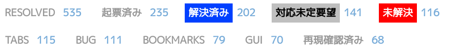

***

## Vivaldiと私の1.5年間

(2016年12月〜2018年5月)

knokmki612

<a xmlns:cc="http://creativecommons.org/ns#" href="https://github.com/knokmki612/vivaldi-2018-tokyo" property="cc:attributionName" rel="cc:attributionURL">knokmki612</a>『vivaldiと私の1.5年間』は<a rel="license" href="http://creativecommons.org/licenses/by/4.0/">クリエイティブ・コモンズ 表示 4.0 国際 ライセンス</a>で提供されています。

---

---

## くのきみ

* Vivaldiでボランティア活動をしている
	* (一応)ソプラノ(テスター)
	* (一応)翻訳者
	* (一応)フォーラムモデレーター

最近あまり活動できていない

***

# ソプラノ

* バグレポート
* バグ修正のチェック

***

## CJK関連の深刻なバグ

(〜2017年5月)

[Sorting of Downloads - Snapshot 1.10.834.9](https://vivaldi.com/blog/snapshots/sorting-of-downloads/)

---

* IMEの変換候補が変な位置に…
* IMEで入力していると変な文字が…

2016年12月からバグレポートしたり

ソプラノやチームとやりとりしたり

**なかなかバグの深刻さが伝わらない！！！**

***

***

## Takaakiさん！！！！！！

(2017年2月〜)

今日は直接感謝の意を伝えられる貴重な日ですね

---

### Takaakiさんの懸命な頑張りの結果

テッちゃん 「**Lets fix them all.** :slightly_smiling_face:」

***

## Hojoさん！！！

(2017年9月〜2018年3月)

* フォーラムの不具合報告をたくさんJIRAにあげてくださった

---

## ノルウェーに日本語話者がいる

**大変ありがたい**

日本のVivaldianのフィードバックがVivaldiチームに反映されるようになった！

---

# 翻訳

* ソフトウェアの翻訳
* サイトの翻訳
* 動画の翻訳
* [日本語公式ブログ](https://jp.vivaldi.net)の翻訳記事

---

## 1.5年でかなり良くなった

違和感のある翻訳がだいぶ減った

---

## やったこと

* 翻訳者の募集
* 表記ゆれの改善
* ガイドラインの作成

---

### 募集

(2017年1月〜)

十数人くらい応募してくれた

* ピンポイントで修正する人
* 新しいリソースを一気に翻訳する人

---

### 表記ゆれ

(2017年4月〜8月)

* web: ウェブ、Web、WEB
* incognito: シークレット、プライベート
* Email: Eメール、メールアドレス、メール

翻訳者で話し合って統一

***

### ガイドライン

(2017年4月〜11月)

[もんど](https://twitter.com/momdo_)さん

「Mozilla Japanに[L10Nガイドライン](https://github.com/mozilla-japan/translation/wiki/L10N-Guideline)あるよ」

* 表記規則
* コンテキストにあわせた翻訳の指針

それをベースにガイドライン作成

---

### ベースと違うところ

英数字と日本語の間には半角空白を入れない！

* 最近のSafariと同じ
* ChromeやFirefoxは半角空白が入る

***

## 動画の翻訳

(2017年4月〜)

<iframe width="560" height="315" src="https://www.youtube.com/embed/r5KXy7LeIYQ?start=132" frameborder="0" allow="autoplay; encrypted-media" allowfullscreen></iframe>

---

## [vivaldi.com](https://vivaldi.com)のキャッチ変更

(2017年11月)

* Takaakiさんの提案
* 翻訳者でたくさんアイデアを出した

---

## 日本語公式ブログの翻訳記事

(2018年3月〜)

* TakaakiさんとHojoさんがやっていた
* [vivaldi.com/blog/](https://vivaldi.com/blog/)の内容の翻訳
* Hojoさんが抜けてから翻訳者の有志がやってくれている

---

# モデレーター

* フォーラムユーザーとやりとり
* NodeBBの機能を活用してフォーラムを管理
* コミュニティのルールに沿った治安維持

---

## やったこと

* サブカテゴリーの作成
* スレッドのタグ管理

---

### サブカテゴリー

(2017年1月〜)

スレッドが内容で仕分けられるようになった

---

### タグ付け

(2017年4月〜)

* 不具合修正や要望の進捗の整理
* 重複スレッドの抑制
* 最近Takaakiさんとzyxwjさんが色付けしてくれた

---

### 固定スレッド

(2017年8月〜)

* 告知やルールの固定表示
* Takaakiさんとzyxwjさんが活用してくれている

---

## zyxwjさん！！！！！！！！！

(2017年8月〜)

* Takaakiさんがスカウトしてくれた
* 彼なしにはフォーラムは成り立たない…！

---

## フォーラムの変化

* 継続して活用してくれるVivaldianが増えている
* モデレーター以外にスレッドに返信する人が！
* 不具合報告や要望だけじゃないコミュニティへ

***

## もっと人増えて！！！

* ソプラノ
* 翻訳者
* モデレーター
* フォーラムユーザー

---

### ソプラノ

こんな人におすすめ

* テクニカルライティング少しでもかじってる方
* Vivaldiチームやソプラノと密にやりとりできる、コミュニテケーションスキルをお持ちの方
* Windows、macOS、Linuxいずれかの環境をお持ちの方

---

### 翻訳者

こんな人におすすめ

* ソフトウェア翻訳の勘所がある方
* 動画や記事の長文翻訳がしたい方
* 自然な表現か自分で判断できる方

---

### モデレーター・フォーラムユーザー

こんな人におすすめ

* 某匿名掲示板の住人みたいなネットスキルをお持ちの方
* 他のVivaldianと交流したい方
* Vivaldiへのフィードバックを継続的にしたい方

***

Vivaldi愛に溢れたみなさん！

# お待ちしてます
